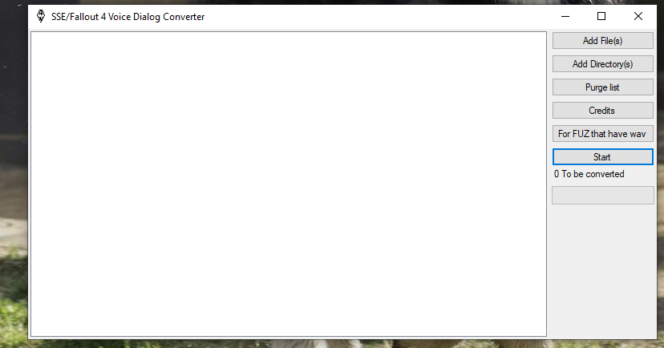

# SSE-Fallout-4-Voice-Dialog-Converter

Check the changelog.MD for more info

This tool can be used to convert given Voice dialog(.fuz) to PS4 format

Requirements:

at9tool.exe found in the PS4 SDK ("Can't give a link sorry")

though if you have it and don't want to install it you can do this extract it than got to "InstallFiles[55]" extract the zip file givin and you got your tool.
you got it installed? even better got to "C:\Program Files (x86)\SCE\ORBIS SDKs\4.500\host_tools\bin"
copy "at9tool.exe" and paste it into the data folder

xWMAEncode.exe found in the DirectX SDK ("https://www.microsoft.com/en-us/download/details.aspx?id=6812")
you don't need to install it, download 7zip, than right click extract this may take a few minutes than go to "Utilities\bin\x86" and copy "xWMAEncode.exe" and paste into the Data folder

fuz_extractor.exe found on the skyrim nexus ("https://www.nexusmods.com/skyrim/mods/950/?")

How to install the required files:

step one(1): copy all the required files to the "Data" folder

How to use this tool:
Get the .fuz files (or folder which contains these files).
When adding the .fuz to the tool you have a couple of options, you can click the "Add Files" button to add multiple files by hand, you can click "Add Directory..." which will search the directory you choose for .fuz files, or you can drag the folder containing the .fuz files onto the app and it will automatically scan and detect .fuz files.
Once you have gotten the .fuz files of your choice onto the too click "Convert" and wait for it to be finished.
Done! Now you can enjoy converted voice dialog!
Questions and answers:

Question: What is this tool for?
answer: This tool converters PC .fuz files to PS4 .fuz files which is played on the PS4.

Question: Do I need to use this tool on my PC .fuz?
answer: Yes, PC .fuz will NOT play on PS4.

You are done use the tool as you wish

